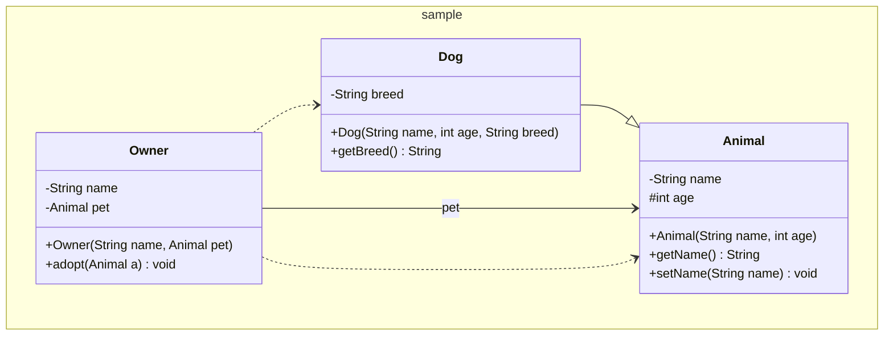

# Reverse Engineer Tools

A collection of static analysis tools that transform Java source code into UML class diagrams rendered in [Mermaid](https://mermaid.js.org/) syntax. These tools automate the reverse engineering process — turning implementation-level code into high-level architectural views that illustrate class structure, relationships, and package organization.

## Motivation

Understanding unfamiliar codebases or documenting existing systems often requires manually drawing diagrams. This project eliminates that effort by parsing Java source files directly and producing accurate, renderable UML class diagrams in Markdown. The output integrates seamlessly with GitHub, GitLab, and any Mermaid-compatible viewer.

## Implementations

| Name | Language | Directory | Description |
|------|----------|-----------|-------------|
| **uml-java** | Java 11+ (Maven) | [`uml-java/`](uml-java/) | Full-featured implementation with OOP architecture, package namespace support, and JUnit 5 test suite |
| **uml-c** | C | [`uml-c/`](uml-c/) | Lightweight single-file implementation for environments without a JVM |

Both implementations produce identical Mermaid output and share the same CLI interface.

## Features

- Parse single files, multiple files, or entire directories recursively
- **Iterative class discovery** — given a single file, automatically locates and parses all referenced classes from the same package directory
- Extract fields and methods with UML visibility modifiers (`+` public, `-` private, `#` protected, `~` package)
- Detect static members
- Detect and render four UML relationship types:
  - **Inheritance** (`extends`) → `--|>`
  - **Implementation** (`implements`) → `..|>`
  - **Association** (field type) → `-->` with field name label
  - **Dependency** (method param/return type, `new` instantiation) → `..>`
- Group classes by Java package into Mermaid `namespace` blocks (Java implementation)
- Skip Javadoc and block/line comments during parsing

## Quick Start

### Java (Recommended)

```bash
cd uml-java

# Build
mvn package

# Run on a single file (auto-discovers referenced classes)
java -jar target/uml4java-1.0-SNAPSHOT.jar \
  --type class --input path/to/MyClass.java --output diagram.md

# Run on an entire directory
java -jar target/uml4java-1.0-SNAPSHOT.jar \
  --type class --input path/to/src/ --output diagram.md

# Run tests
mvn test
```

### C

```bash
cd uml-c

# Build
make

# Run
./uml4java --type class --input path/to/MyClass.java --output diagram.md
```

## Architecture (Java)

The Java implementation follows a **pipeline architecture** with clear separation of concerns:

```
Input (.java files) → Parse → Discover → Analyze → Generate → Output (.md file)
```

```
uml-java/src/main/java/uml4java/
├── model/              Domain layer (no external dependencies)
│   ├── Member.java              Abstract base for class members
│   ├── FieldMember.java         Field representation + Mermaid rendering
│   ├── MethodMember.java        Method representation + Mermaid rendering
│   ├── ClassInfo.java           Parsed class data + Mermaid rendering
│   └── Relationship.java       UML relationship + Mermaid rendering
├── parser/             Input layer (depends on: model)
│   ├── JavaParser.java          Reads .java files → produces model objects
│   └── TypeResolver.java        Classifies types as primitive/known/unresolved
├── analysis/           Processing layer (depends on: model, parser)
│   ├── ClassDiscoverer.java     Finds referenced classes on the filesystem
│   └── RelationshipDetector.java Infers UML relationships from model data
├── output/             Output layer (depends on: model only)
│   └── UmlGenerator.java       Renders model → Mermaid Markdown with namespaces
└── Uml4Java.java       Entry point / orchestrator
```

Design principles applied:
- **High encapsulation** — all fields are private with controlled access
- **High cohesion** — each class has a single, well-defined responsibility
- **Low coupling** — layers depend only downward; output knows nothing about parsing
- **Polymorphism** — Member subclasses render themselves via `toMermaid()`

## Sample Output

Given a set of Java source files, the tool produces:



## CLI Reference

```
java uml4java.Uml4Java --type class --input <path> [<path2> ...] --output <output.md>
```

| Argument | Description |
|----------|-------------|
| `--type class` | Diagram type (currently only `class` is supported) |
| `--input <path>` | One or more Java files or directories to parse |
| `--output <file>` | Path to the generated Markdown file |

## Rendering the Output

The generated Markdown uses Mermaid fenced code blocks. Supported renderers:

- **GitHub / GitLab** — renders automatically in `.md` files
- **VS Code** — with the [Markdown Preview Mermaid Support](https://marketplace.visualstudio.com/items?itemName=bierner.markdown-mermaid) extension
- **Mermaid Live Editor** — paste diagram text at [mermaid.live](https://mermaid.live) for interactive preview and export

## Requirements

- **Java**: Java 11+, Maven 3.6+
- **C**: GCC or any C99-compatible compiler
