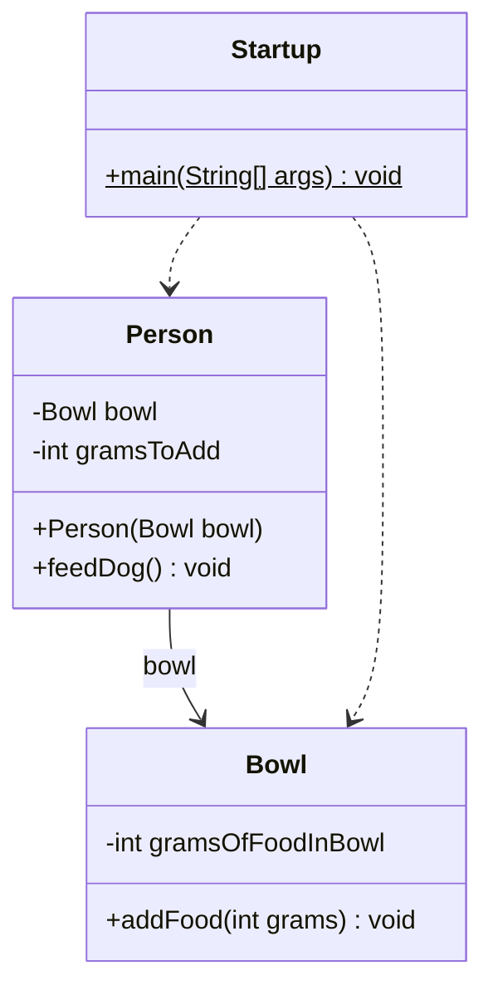

# UML4Java - Java to UML Class Diagram Generator

A C program that parses Java files and generates UML class diagrams in Markdown format using Mermaid syntax.

## Build

```bash
make
```

Or directly:

```bash
gcc -Wall -O2 -o uml4java uml4java.c
```

## Usage

```bash
./uml4java --type class --input <java_file> --output <output.md>
```

### Example

```bash
# Single file - automatically discovers Person.java and Bowl.java
./uml4java --type class \
  --input ../code-master/src/main/java/se/leiflindback/oodbook/javaessentials/references/Startup.java \
  --output reference_class.md

# Multiple files
./uml4java --type class \
  --input ../code-master/src/main/java/se/leiflindback/oodbook/javaessentials/references/Startup.java \
         ../code-master/src/main/java/se/leiflindback/oodbook/javaessentials/references/Person.java \
  --output reference_class.md

# Entire directory (recursively scans all .java files)
./uml4java --type class \
  --input ../code-master/src/main/java/se/leiflindback/oodbook/javaessentials/references/ \
  --output reference_class.md
```

## Features

- Parses single or multiple Java files, or an entire directory
- **Iterative class discovery**: given a single file, automatically finds and parses all referenced classes (field types, method params, `new` instantiations, extends/implements) from the same package directory
- Extracts fields and methods with visibility modifiers
- Detects static members
- Detects class relationships:
  - Inheritance (`extends`) → solid line with triangle
  - Implementation (`implements`) → dashed line with triangle
  - Association (field type) → solid arrow, labeled with field name
  - Dependency (method parameter/return type, `new`) → dashed arrow
- Generates Mermaid UML class diagrams in Markdown format
- Supports visibility: public (+), private (-), protected (#), package (~)

## Output Format

The program generates a Markdown file with a Mermaid class diagram that can be rendered in GitHub, GitLab, or any Markdown viewer that supports Mermaid.

### Sample Output (multiple files)



## Clean

```bash
make clean
```
