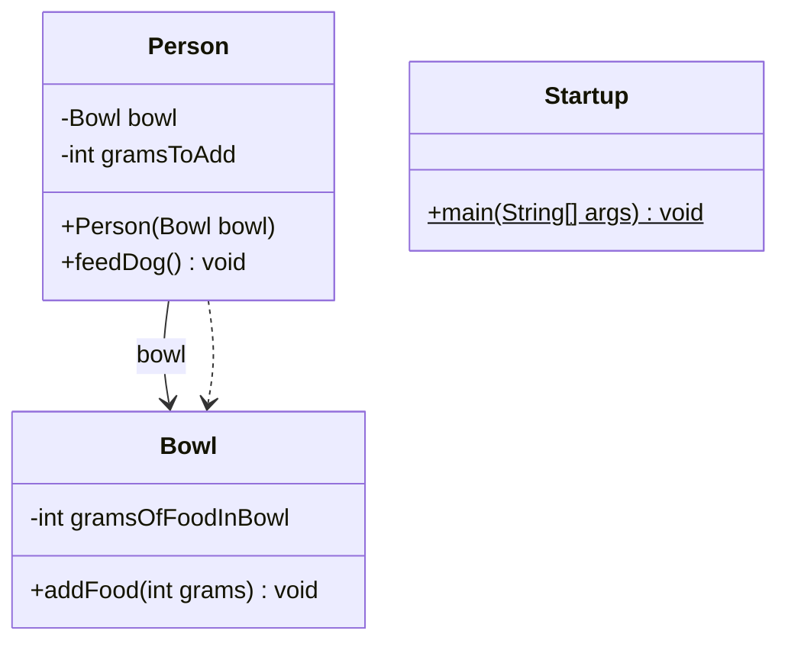

# UML Class Diagram

```mermaid
classDiagram
    class Bowl {
        -int gramsOfFoodInBowl
        +addFood(int grams) void
    }
    class Person {
        -Bowl bowl
        -int gramsToAdd
        +Person(Bowl bowl)
        +feedDog() void
    }
    class Startup {
        +main(String[] args)$ void
    }
    Person --> Bowl : bowl
    Person ..> Bowl
```
