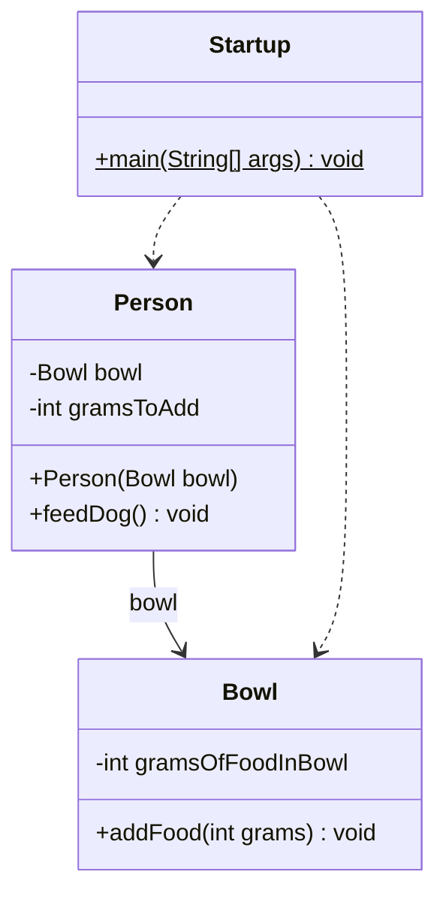

# UML4Java (Java version)

A Java program that parses Java files and generates UML class diagrams in Markdown format using Mermaid syntax.

## File Structure

```
ood/uml-maven/
├── src/
│   └── main/
│       └── java/
│           └── uml4java/
│               ├── Member.java          # Field/method data
│               ├── ClassInfo.java       # Class data (name, extends, implements, members)
│               ├── Relationship.java    # Relationship type + endpoints
│               ├── JavaParser.java      # Parsing + iterative discovery + relationship detection
│               ├── UmlGenerator.java    # Mermaid markdown output
│               └── Uml4Java.java        # Main entry point (CLI)
├── pom.xml
├── Makefile
├── uml4java.sh                          # Convenience script (compile + run)
└── README.md
```

## Features

- Parses single or multiple Java files, or an entire directory
- **Iterative class discovery**: given a single file, automatically finds and parses all referenced classes (field types, method params, `new` instantiations, extends/implements) from the same package directory
- Extracts fields and methods with visibility modifiers
- Detects static members
- Detects class relationships:
  - Inheritance (`extends`) → solid line with triangle
  - Implementation (`implements`) → dashed line with triangle
  - Association (field type) → solid arrow, labeled with field name
  - Dependency (method parameter/return type, `new`) → dashed arrow
- Generates Mermaid UML class diagrams in Markdown format
- Supports visibility: public (+), private (-), protected (#), package (~)


## Build and Run with Java and Maven

### Build

```bash
mvn package
```

### Run

```bash
java -jar target/uml4java-1.0-SNAPSHOT.jar --type class --input <java_file_or_dir> [<file2> ...] --output <output.md>
```

Or using Maven exec plugin (no need to package first):

```bash
mvn compile exec:java -Dexec.mainClass="uml4java.Uml4Java" -Dexec.args="--type class --input <java_file_or_dir> [<file2> ...] --output <output.md>"
```

### Examples

```bash
# Single file - automatically discovers Person.java and Bowl.java
java -jar target/uml4java-1.0-SNAPSHOT.jar --type class \
  --input ../code-master/src/main/java/se/leiflindback/oodbook/javaessentials/references/Startup.java \
  --output reference_class.md

# Same example using mvn exec:java
mvn compile exec:java -Dexec.mainClass="uml4java.Uml4Java" \
  -Dexec.args="--type class --input ../code-master/src/main/java/se/leiflindback/oodbook/javaessentials/references/Startup.java --output reference_class.md"

# Multiple files
java -jar target/uml4java-1.0-SNAPSHOT.jar --type class \
  --input ../code-master/src/main/java/se/leiflindback/oodbook/javaessentials/references/Startup.java \
         ../code-master/src/main/java/se/leiflindback/oodbook/javaessentials/references/Person.java \
  --output reference_class.md

# Entire directory (recursively scans all .java files)
java -jar target/uml4java-1.0-SNAPSHOT.jar --type class \
  --input ../code-master/src/main/java/se/leiflindback/oodbook/javaessentials/references/ \
  --output reference_class.md

# Same example using mvn exec:java
mvn compile exec:java -Dexec.mainClass="uml4java.Uml4Java" \
  -Dexec.args="--type class --input ../code-master/src/main/java/se/leiflindback/oodbook/javaessentials/references/ --output reference_class.md"
```

```
mvn compile exec:java -Dexec.mainClass="uml4java.Uml4Java" \
  -Dexec.args="--type class --input ../code-master/src/main/java/se/leiflindback/oodbook/rentcar/ --output reference_class.md"
```

### Clean

```bash
mvn clean
```

---

## Sample Output

Running with `Startup.java` as input (auto-discovers `Person.java` and `Bowl.java`):



---

## About Mermaid

The output uses [Mermaid](https://mermaid.js.org/) syntax inside a ` ```mermaid ` code fence. Mermaid is a diagram rendering engine that turns text into visual diagrams directly in Markdown. Platforms with built-in Mermaid support include:

- **GitHub** / **GitLab** — renders automatically in `.md` files
- **VS Code** — with the [Markdown Preview Mermaid Support](https://marketplace.visualstudio.com/items?itemName=bierner.markdown-mermaid) extension

If your Markdown viewer does not support Mermaid, you can paste the diagram text into the [Mermaid Live Editor](https://mermaid.live) to preview and export.

Mermaid supports many diagram types beyond class diagrams, such as sequence diagrams, flowcharts, ER diagrams, and state diagrams. See the full documentation at: https://mermaid.js.org/intro/
