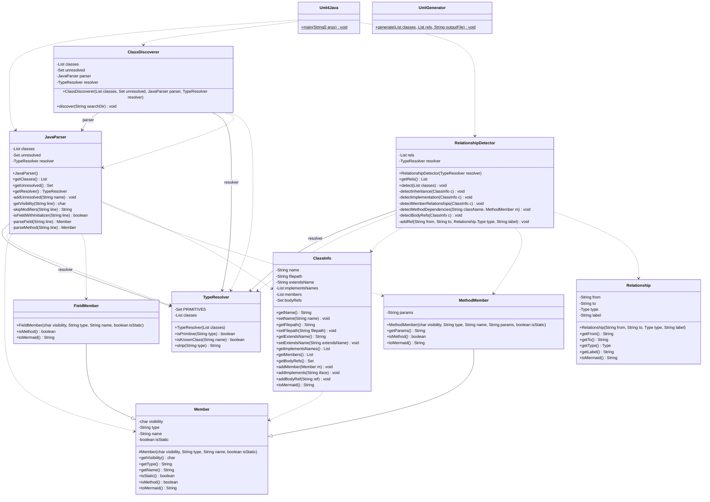

# UML Class Diagram

```mermaid
classDiagram
    class ClassDiscoverer {
        -List classes
        -Set unresolved
        -JavaParser parser
        -TypeResolver resolver
        +ClassDiscoverer(List<ClassInfo> classes, Set<String> unresolved, JavaParser parser, TypeResolver resolver)
        +discover(String searchDir) void
    }
    class ClassInfo {
        -String name
        -String filepath
        -String extendsName
        -List implementsNames
        -List members
        -Set bodyRefs
        +getName() String
        +setName(String name) void
        +getFilepath() String
        +setFilepath(String filepath) void
        +getExtendsName() String
        +setExtendsName(String extendsName) void
        +getImplementsNames() List<String>
        +getMembers() List<Member>
        +getBodyRefs() Set<String>
        +addMember(Member m) void
        +addImplements(String iface) void
        +addBodyRef(String ref) void
        +toMermaid() String
    }
    class FieldMember {
        +FieldMember(char visibility, String type, String name, boolean isStatic)
        +isMethod() boolean
        +toMermaid() String
    }
    class JavaParser {
        -List classes
        -Set unresolved
        -TypeResolver resolver
        +JavaParser()
        +getClasses() List<ClassInfo>
        +getUnresolved() Set<String>
        +getResolver() TypeResolver
        -addUnresolved(String name) void
        -getVisibility(String line) char
        -skipModifiers(String line) String
        -isFieldWithInitializer(String line) boolean
        -parseField(String line) Member
        -parseMethod(String line) Member
    }
    class Member {
        -char visibility
        -String type
        -String name
        -boolean isStatic
        #Member(char visibility, String type, String name, boolean isStatic)
        +getVisibility() char
        +getType() String
        +getName() String
        +isStatic() boolean
        +isMethod() boolean
        +toMermaid() String
    }
    class MethodMember {
        -String params
        +MethodMember(char visibility, String type, String name, String params, boolean isStatic)
        +getParams() String
        +isMethod() boolean
        +toMermaid() String
    }
    class Relationship {
        -String from
        -String to
        -Type type
        -String label
        +Relationship(String from, String to, Type type, String label)
        +getFrom() String
        +getTo() String
        +getType() Type
        +getLabel() String
        +toMermaid() String
    }
    class RelationshipDetector {
        -List rels
        -TypeResolver resolver
        +RelationshipDetector(TypeResolver resolver)
        +getRels() List<Relationship>
        +detect(List<ClassInfo> classes) void
        -detectInheritance(ClassInfo c) void
        -detectImplementation(ClassInfo c) void
        -detectMemberRelationships(ClassInfo c) void
        -detectMethodDependencies(String className, MethodMember m) void
        -detectBodyRefs(ClassInfo c) void
        -addRel(String from, String to, Relationship.Type type, String label) void
    }
    class TypeResolver {
        -Set PRIMITIVES
        -List classes
        +TypeResolver(List<ClassInfo> classes)
        +isPrimitive(String type) boolean
        +isKnownClass(String name) boolean
        +strip(String type) String
    }
    class Uml4Java {
        +main(String[] args)$ void
    }
    class UmlGenerator {
        +generate(List<ClassInfo> classes, List<Relationship> rels, String outputFile)$ void
    }
    ClassDiscoverer --> JavaParser : parser
    ClassDiscoverer --> TypeResolver : resolver
    ClassDiscoverer ..> JavaParser
    ClassDiscoverer ..> TypeResolver
    ClassInfo ..> Member
    FieldMember --|> Member
    JavaParser --> TypeResolver : resolver
    JavaParser ..> TypeResolver
    JavaParser ..> Member
    JavaParser ..> FieldMember
    JavaParser ..> MethodMember
    JavaParser ..> ClassInfo
    MethodMember --|> Member
    RelationshipDetector --> TypeResolver : resolver
    RelationshipDetector ..> TypeResolver
    RelationshipDetector ..> ClassInfo
    RelationshipDetector ..> MethodMember
    RelationshipDetector ..> Relationship
    Uml4Java ..> JavaParser
    Uml4Java ..> ClassDiscoverer
    Uml4Java ..> RelationshipDetector
```
