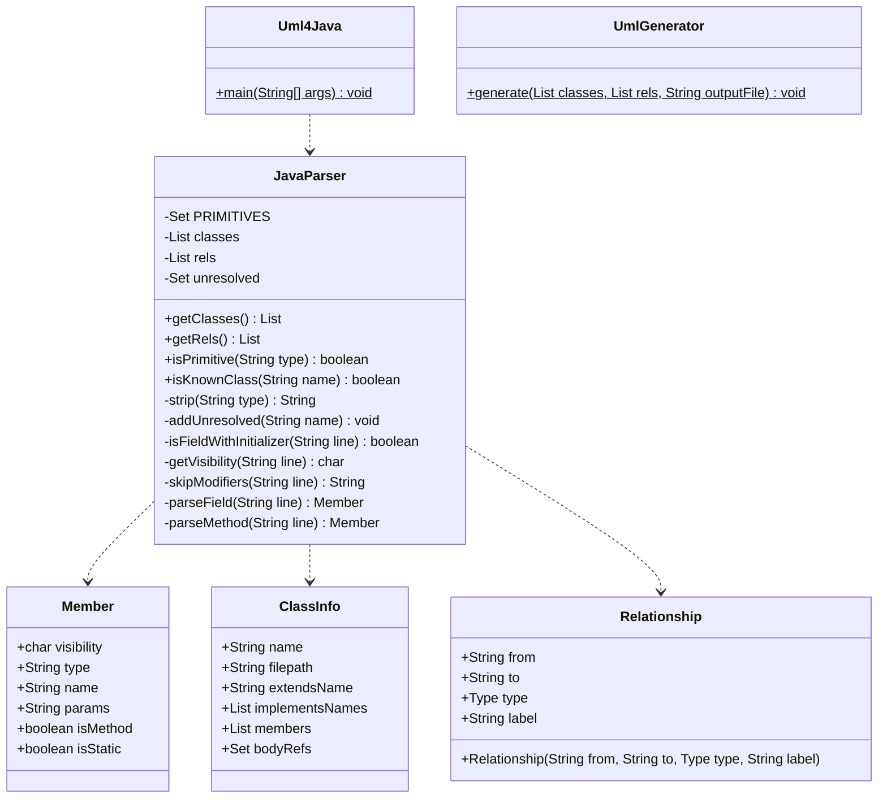

# UML Class Diagram

```mermaid
classDiagram
    class ClassInfo {
        +String name
        +String filepath
        +String extendsName
        +List implementsNames
        +List members
        +Set bodyRefs
    }
    class JavaParser {
        -Set PRIMITIVES
        -List classes
        -List rels
        -Set unresolved
        +getClasses() List<ClassInfo>
        +getRels() List<Relationship>
        +isPrimitive(String type) boolean
        +isKnownClass(String name) boolean
        -strip(String type) String
        -addUnresolved(String name) void
        -isFieldWithInitializer(String line) boolean
        -getVisibility(String line) char
        -skipModifiers(String line) String
        -parseField(String line) Member
        -parseMethod(String line) Member
    }
    class Member {
        +char visibility
        +String type
        +String name
        +String params
        +boolean isMethod
        +boolean isStatic
    }
    class Relationship {
        +String from
        +String to
        +Type type
        +String label
        +Relationship(String from, String to, Type type, String label)
    }
    class Uml4Java {
        +main(String[] args)$ void
    }
    class UmlGenerator {
        +generate(List<ClassInfo> classes, List<Relationship> rels, String outputFile)$ void
    }
    JavaParser ..> Member
    JavaParser ..> ClassInfo
    JavaParser ..> Relationship
    Uml4Java ..> JavaParser
```
